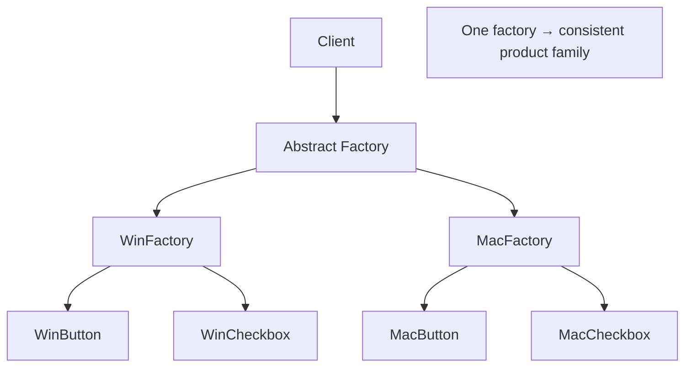

# Abstract Factory (Абстрактная фабрика)

**Область:** GoF / Creational

---

## Смысл паттерна

**Abstract Factory** предоставляет интерфейс для создания **семейства связанных объектов** без привязки клиента к конкретным классам.

Один «завод» (`WinFactory` или `MacFactory`) выпускает согласованный набор продуктов (кнопка + чекбокс в одном стиле). Смена платформы — замена одной фабрики, а не перебор `if (os === 'win')` по всему коду.

---

## Схема

## Как устроено демо

В `abstract-factory-class.js` / `abstract-factory-functional.js`:

1. **Продукты** — `WinButton`, `MacButton`, `WinCheckbox`, `MacCheckbox`; у каждого `paint()`.
2. **`GUIFactory`** — абстрактная фабрика с `createButton()` и `createCheckbox()`.
3. **`WinFactory` / `MacFactory`** — создают продукты одного семейства.
4. **`Application`** — клиент: в конструкторе получает фабрику, создаёт UI-компоненты и вызывает `paint()`.

Демо выбирает фабрику по переменной `os` и печатает массив строк отрисовки — всё приложение собрано в едином стиле.

---

## Когда применять

- Нужны **согласованные наборы** объектов (UI-тема, БД + репозиторий + миграции одного вендора).
- Система должна быть **независима** от способа создания и состава семейства.
- Продукты **не должны смешиваться** между семействами (Mac-кнопка + Win-чекбокс).
- Конфигурация платформы/окружения задаётся **одним выбором фабрики** при старте.

## Когда не стоит

- Нужен **один** продукт с вариантами — достаточно Factory Method или простой фабрики.
- Семейства продуктов **растут** быстрее, чем платформы — матрица классов раздувается.
- В JS проще **объект конфигурации + функции**, если нет жёсткой иерархии классов.

---

## Связь с другими паттернами

- **Factory Method** — создаёт **один** тип продукта; Abstract Factory — **несколько связанных**.
- **Builder** — пошаговая сборка **одного** сложного объекта; Abstract Factory — набор **отдельных** продуктов.
- **Dependency Injection** — часто подставляет «фабрику» или провайдеры вместо явной иерархии GoF.

---

## Варианты демо

| Файл | Парадигма |
|------|-----------|
| `abstract-factory-class.js` | Классы / ООП (классическая GoF-форма) |
| `abstract-factory-functional.js` | Функции, замыкания, plain objects |

Оба файла показывают **одну и ту же идею** на одном сценарии — сравнивай рядом.

---

## Краткий итог

Abstract Factory = **одна точка создания целого семейства** согласованных объектов. Клиент знает только контракт фабрики, а не конкретные классы кнопок и чекбоксов.
