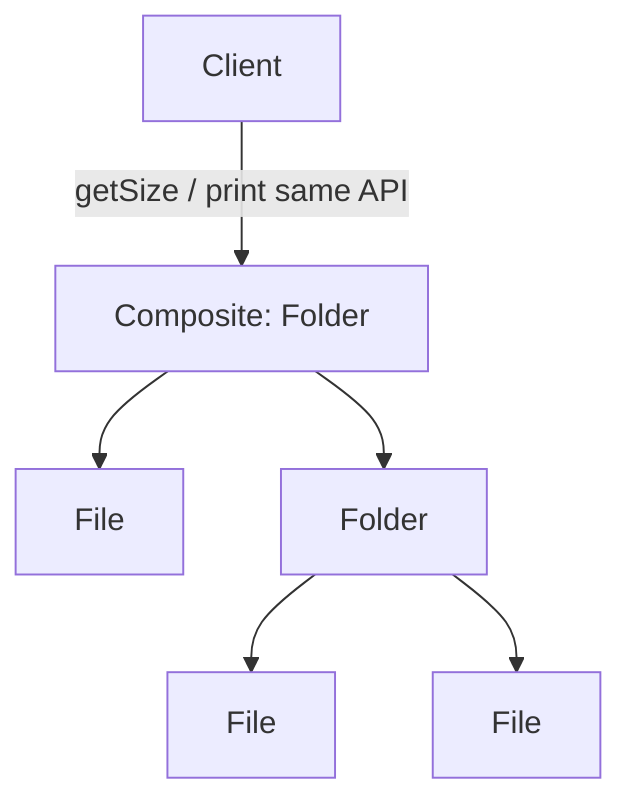

# Composite (Компоновщик)

**Область:** GoF / Structural

---

## Смысл паттерна

**Composite** собирает объекты в **дерево «часть–целое»** и даёт клиенту **единый интерфейс** для листьев и составных узлов.

Папка и файл оба поддерживают `getSize()` и `print()` — клиент не различает, один объект или дерево. Рекурсия на составных узлах обрабатывает всё поддерево автоматически.

---

## Схема

## Как устроено демо

В `composite-class.js` / `composite-functional.js`:

1. **`FileSystemItem` (Component)** — общий контракт: `name`, `getSize()`, `print()`.
2. **`File` (Leaf)** — хранит `size`, возвращает его напрямую.
3. **`Folder` (Composite)** — массив `children`, `add/remove`, `getSize()` суммирует детей, `print()` обходит дерево с отступом.

Демо строит `project/src/…`, печатает дерево и выводит общий размер корня — один вызов `root.getSize()` для всей иерархии.

---

## Когда применять

- Древовидная структура: **файлы, UI, меню, org-chart, сцена в игре**.
- Клиент должен **одинаково** обрабатывать листья и контейнеры.
- Операции **рекурсивны** по умолчанию (размер, отрисовка, поиск).
- Нужно **вкладывать** группы произвольной глубины без `if (isFolder)`.

## Когда не стоит

- Структура **строго плоская** — лишняя абстракция.
- Листья и узлы **слишком разные** по API — общий Component становится пустышкой.
- Производительность критична при **огромных** деревьях без ленивых стратегий.

---

## Связь с другими паттернами

- **Decorator** — оборачивает **один** объект; Composite — **дерево** детей.
- **Flyweight** — экономит память в **массовых** листьях с общим состоянием.
- **Iterator** — обход дерева; Composite задаёт **структуру** для обхода.
- **Compound Components (React)** — UX-аналог «семейства частей», не рекурсивный `getSize()`.

---

## Варианты демо

| Файл | Парадигма |
|------|-----------|
| `composite-class.js` | Классы / ООП (классическая GoF-форма) |
| `composite-functional.js` | Функции, замыкания, plain objects |

Оба файла показывают **одну и ту же идею** на одном сценарии — сравнивай рядом.

---

## Краткий итог

Composite = **единый интерфейс для узла и всего поддерева**. Папка делегирует операции детям так же, как если бы они были одним объектом.
