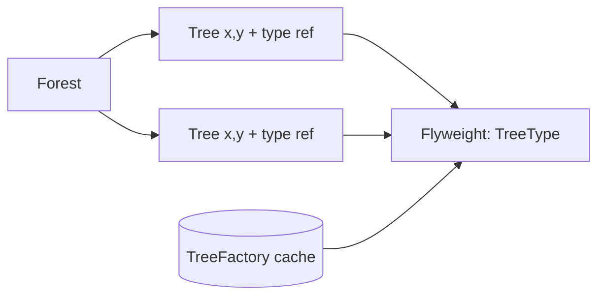

# Flyweight (Приспособленец)

**Область:** GoF / Structural

---

## Смысл паттерна

**Flyweight** разделяет состояние на **intrinsic** (общее, хранится в flyweight и переиспользуется) и **extrinsic** (уникальное, передаётся снаружи при использовании).

Тысячи деревьев на карте не должны дублировать тяжёлые данные текстуры и типа — достаточно нескольких shared `TreeType` и лёгких объектов с координатами `(x, y)`.

---

## Схема

## Как устроено демо

В `flyweight-class.js` / `flyweight-functional.js`:

1. **`TreeType` (Flyweight)** — intrinsic: `name`, `color`, `texture`; метод `draw(canvas, x, y)` получает extrinsic координаты.
2. **`TreeFactory`** — кэш `Map` по ключу `name_color_texture`; создаёт тип один раз.
3. **`Tree` (Context)** — extrinsic `x`, `y` + ссылка на shared `type`.
4. **`Forest`** — `plantTree()` запрашивает тип у фабрики и добавляет `Tree`.

Демо сажает три дерева, но только **два уникальных** `TreeType` (два дуба делят один flyweight). `draw()` собирает команды отрисовки.

---

## Когда применять

- **Много** однотипных объектов (частицы, тайлы, символы текста, иконки).
- Большая часть памяти уходит в **повторяющиеся** immutable-данные.
- Extrinsic-состояние **компактно** (координаты, id), intrinsic **тяжёлое** (меш, текстура, шрифт).
- Объектов больше, чем разумно держать как полноценные экземпляры класса.

## Когда не стоит

- Объектов **мало** или почти все **уникальны** — выигрыша нет.
- Intrinsic-состояние **часто меняется** — шаринг опасен.
- Усложняет код сильнее, чем экономит RAM/CPU в вашем масштабе.

---

## Связь с другими паттернами

- **Singleton / Factory** — `TreeFactory` + кэш как **пул** shared flyweight.
- **Composite** — дерево часто содержит **массовые листья**, где Flyweight экономит память.
- **Object Pool** — переиспользует **объекты целиком**; Flyweight — **общие части** состояния.

---

## Варианты демо

| Файл | Парадигма |
|------|-----------|
| `flyweight-class.js` | Классы / ООП (классическая GoF-форма) |
| `flyweight-functional.js` | Функции, замыкания, plain objects |

Оба файла показывают **одну и ту же идею** на одном сценарии — сравнивай рядом.

---

## Краткий итог

Flyweight = **общая «тяжёлая» часть + лёгкий контекст с координатами**. Фабрика гарантирует один `TreeType` на комбинацию name/color/texture.
