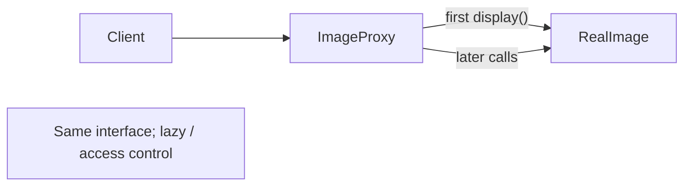

# Proxy (Заместитель)

**Область:** GoF / Structural

---

## Смысл паттерна

**Proxy** подставляет **объект-заместитель** вместо реального субъекта с **тем же интерфейсом**, добавляя контроль: ленивая загрузка, кэш, права доступа, логирование.

Клиент работает с `Image` одинаково; не знает, `RealImage` это или `ImageProxy`, который создаст реальный объект только при первом `display()`.

---

## Схема

## Как устроено демо

В `proxy-class.js` / `proxy-functional.js` — **Virtual Proxy**:

1. **`Image`** — общий интерфейс `display()`.
2. **`RealImage`** — в конструкторе сразу вызывает `loadFromDisk()` (дорогая операция).
3. **`ImageProxy`** — хранит `filename` и `realImage = null`; при первом `display()` создаёт `RealImage`, дальше делегирует.

Демо создаёт proxy без загрузки файла; первый `display()` — load + show; второй — только show, без повторной загрузки.

---

## Когда применять

- **Ленивая инициализация** тяжёлых ресурсов (изображения, большие отчёты, remote API).
- **Контроль доступа** (проверка прав перед вызовом real subject).
- **Кэширование** результатов дорогих операций.
- **Удалённый proxy** — локальная заглушка для сетевого сервиса.

## Когда не стоит

- Нужно **расширить поведение** цепочкой фич — Decorator.
- Прокси **дублирует** весь API real subject без выгоды — лишний слой.
- В JS для метaprogramming часто хватает встроенного **`Proxy`** языка.

---

## Связь с другими паттернами

- **Decorator** — тот же интерфейс, но **добавляет** обязанности; Proxy **контролирует доступ** к одному субъекту.
- **Adapter** — **меняет** интерфейс; Proxy **сохраняет** его.
- **Facade** — упрощает **подсистему**; Proxy — **один** объект-замена.

---

## Варианты демо

| Файл | Парадигма |
|------|-----------|
| `proxy-class.js` | Классы / ООП (классическая GoF-форма) |
| `proxy-functional.js` | Функции, замыкания, plain objects |

Оба файла показывают **одну и ту же идею** на одном сценарии — сравнивай рядом.

---

## Краткий итог

Proxy = **та же «картинка», но загрузка отложена**. `ImageProxy` создаёт `RealImage` только когда клиент реально запрашивает отображение.
